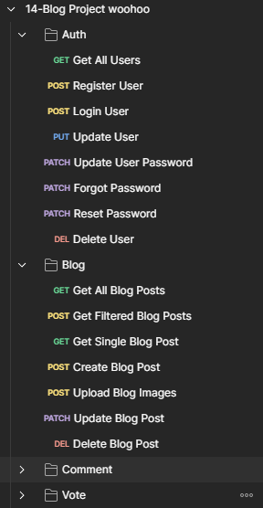
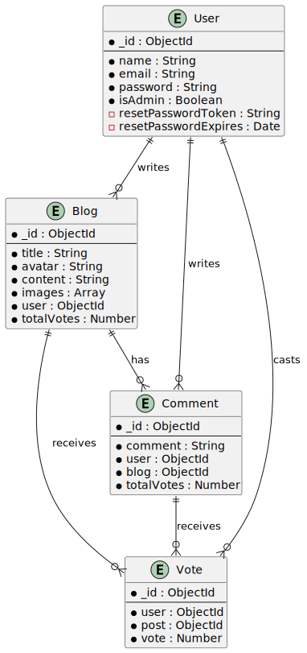

## Table of Contents
1. [Project Status](#project-status)
2. [Project Screenshots](#project-screenshots)
3. [Installation and Setup Instructions](#installation-and-setup-instructions)
4. [Features](#usage-or-features)
5. [Technologies](#technologies)
6. [Reflection](#reflection)
7. [Contributing](#contributing)
8. [License](#license)

## My Blog - share your ideas with the world!

An application with CRUD functionality, via which users can create and modify blog posts, comments, votes and more! Built with Express, JavaScript, and Mongoose. 

## Project Status

This project is complete. Tests remain to be conducted on some functions, but the project should be fully functional and working without any pending issues. If you do notice some issues, feedback is appriciated at the following e-mail: stevanzivanovic48@gmail.com 

## Project Screen Shot(s)  

**Routes 1**

**Routes 2**

**Database Diagram**

## Installation and Setup Instructions

Clone down this repository. You will need `node` and `npm` installed globally on your machine. To use the blog-project-backend, please create a new .env file at the root of the directory. You will need to provide the port on which you would like for the project to run locally on (PORT) - default is 5000, your own mongoDB credentails (MONGO_URL), a jwt secret and lifetime (JWT_SECRET, JWT_LIFETIME), your own cloudinary name, api key, secret (CLOUDINARY_NAME, CLOUDINARY_API_KEY, CLOUDINARY_API_SECRET), as well as a sendgrid api key (SENDGRID_API_KEY).

**Installation:**

Once the .env files are populated on the backend, please run the npm install command.  

To Run Test Suite:  

`npm test`  

To Start Server:

`npm start`  

To Visit App:

`localhost:3000`

## Features

**Complex State Management:** The backend manages a complex state operation with over 30 routes communicating with the frontend. As the frontend project's requirements expanded, the backend routes were scaled accordingly.

**Password Reset Functionality:** The backend supports a comprehensive password reset functionality. It allows users to reset their password if they know their current one. If not, a secure reset process via email is provided.

**Image Upload:** The backend supports image uploads for user profile pictures and blog posts. It accommodates both file uploads and URL inputs, implemented using Cloudinary and Multer for image hosting and file handling.

**Voting System:** A Reddit-like voting system is implemented for blog posts and comments. Users can upvote, downvote, or neutralize their vote on a blog post or a comment. The system is designed to allow users to switch their vote from upvote to downvote and vice versa.

**Optimized Data Fetching:** To enhance performance, the backend implements an optimized data fetching system. It provides features like limit, sort, and order for blog posts and comments. This is achieved by creating separate routes for blogs, comments, and votes.

**Robust Error Handling:** The backend features robust error handling to improve user experience. In case of any issues, users receive friendly and understandable messages instead of machine-generated ones.

**Middleware Functionality:** The backend includes middleware for authentication, file uploads, data extraction, and more. These middleware functions ensure a seamless user experience.

## Technologies

This project leverages a variety of technologies and libraries to provide a rich, interactive user experience. Here are some of the key technologies used:

*Express:* The backbone of the application's backend, Express is a minimal and flexible Node.js web application framework that provides a robust set of features for web and mobile applications.

*Cloudinary:* The Cloudinary Node SDK enables quick and easy integration with Cloudinary for handling file uploads.

*express-async-errors:* This minimalistic library wraps the Layer#handle property, leaving all the rest of the Express internals intact, to handle asynchronous errors.

*express-mongo-sanitize:* This library sanitizes user input to prevent MongoDB operator injection, which could change the context of a database operation.

*express-rate-limit:* This middleware limits repeated requests to public APIs and/or endpoints such as password reset to prevent abuse.

*Helmet:* Helmet enhances the security of Express apps by setting various HTTP response headers.

*http-status-codes:* This library provides constants enumerating the HTTP status codes, based on the Java Apache HttpStatus API.

*Joi:* A powerful schema description language and data validator for JavaScript, used extensively for validating controller functions in the app.

*jsonwebtoken:* JSON Web Tokens (JWTs) are used for securely transmitting information between parties as a JSON object. In this app, JWTs are used for authentication tokens.

*Mongoose:* Mongoose is a MongoDB object modeling tool designed to work in an asynchronous environment. It is used extensively in this project to interact with the MongoDB database.

*Morgan:* An HTTP request logger middleware for Node.js, Morgan is especially useful during the development phase of a project.

*Multer:* Multer is a Node.js middleware for handling multipart/form-data, primarily used for uploading files. It is written on top of busboy for maximum efficiency.

I'm excited to explore and implement different technologies in future projects!

## Reflection

This was a three-month-long project built upon completion of various Udemy coursework. Project goals included using technologies learned up until this point and familiarizing myself with documentation for new features.

The primary aim was to build a robust backend for a blog project that allowed users to create, read, update, and delete blog posts, comments, and votes. As the frontend requirements grew, the backend had to evolve to support the increasing complexity.

*Managing Complex State Operations:* The backend had to manage over 30 routes to cater to the frontend's needs. This required careful planning and multiple refactors to ensure all routes worked correctly and executed in order.

*Implementing Password Reset Functionality:* Implementing a secure password reset functionality was a significant challenge. It required creating complex routes on the backend to handle data exchange between the frontend and backend securely.

*Handling File Uploads:* Implementing the ability to add files or images for the profile picture or blog post pictures was a complex task. It involved setting up routes to handle image uploads, processing the uploaded images, and returning the URLs of the uploaded images to the frontend.

*Creating a Voting System:* Implementing a Reddit-like voting system for blog posts and comments was a unique challenge. It required creating a new type of object linked to both blog posts and comments and managing the logic for upvoting, downvoting, and removing votes.

*Optimizing Data Fetching:* As the amount of data increased, I noticed a slowdown in the loading times for blog posts, comments, and votes. To address this, I had to implement a completely new route for fetching blog posts and optimize the fetching of comments. This involved creating separate routes for blogs, comments, and votes on the backend.

*Robust Error Handling and Middleware Functionality:* Implementing robust error handling and middleware functionality for authentication, file uploads, and data extraction was crucial for a seamless user experience.

This project was the first full-stack project I've ever built, and it was a significant learning experience. It pushed me to explore new technologies, delve into complex topics, and improve my problem-solving skills. I'm excited to apply what I've learned in future projects!

## Contributions
At this time, the best way to contribute is by providing feedback on any issues you encounter. Please email your feedback to stevanzivanovic48@gmail.com. As I become more familiar with GitHub and open source workflows, I plan to open up this project for more direct contributions. Thank you for your understanding and support!

## License
This project is open source, and as such, the code is available for anyone to look at. However, I haven't yet chosen a specific open source license, so please respect the unlicensed nature of the project for now. I'm currently learning more about open source licenses and will update this section once I've chosen a license that fits the project's needs.
